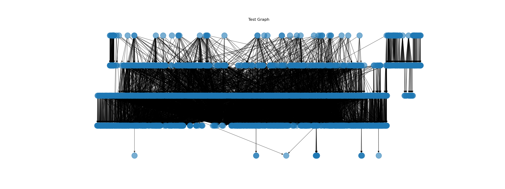

# Conda Recipe Manager CLI Overview

This document provides a brief overview of all the CLI tools provided by `Conda Recipe Manager` (CRM).

All tools are executed by running `conda-recipe-manger <tool-name>` or `crm <tool-name>`.

To get a full list of all currently available tools, run: `crm --help`
To get help with a particular tool, run: `crm <tool-name> --help`

All of these commands should return a POSIX-style error code when they encounter an issue. The codes should correlate
to unique error cases.

<!-- TOC -->

- [Conda Recipe Manager CLI Overview](#conda-recipe-manager-cli-overview)
- [List of Tools](#list-of-tools)
    - [convert](#convert)
        - [Usage](#usage)
    - [graph](#graph)
        - [Usage](#usage)
    - [patch](#patch)
        - [Usage](#usage)
    - [rattler-bulk-build](#rattler-bulk-build)
        - [Usage](#usage)

<!-- /TOC -->

# List of Tools

## `convert`
This tool converts one or more recipe files from the V0 recipe format to the
[V1 recipe format](https://github.com/conda/ceps/blob/main/cep-14.md).

In single file mode, a converted recipe file is dumped to `STDOUT` or can be written to a specified file using the `-o`
option. Warnings and errors are printed to `STDERR`

In bulk (multi-recipe) mode, the converted recipe files can written to a `recipe.yaml` file in the same directory as
the original V0 `meta.yaml` file is found in. Various statistics about the bulk conversion process are dumped to a
JSON blob to `STDOUT`.

### Usage
```sh
Usage: crm convert [OPTIONS] PATH

  Recipe conversion CLI utility. By default, recipes print to STDOUT. Messages
  always print to STDERR. Takes 1 file or a directory containing multiple
  feedstock repositories. If the `PATH` provided is a directory, the script
  will attempt a bulk operation conversion across all subdirectories.

Options:
  -o, --output PATH               File to dump a new recipe to. For bulk
                                  operations, specify the file basename only
                                  (i.e. recipe.yaml).
  -m, --min-success-rate FLOAT RANGE
                                  Sets a minimum passing success rate for bulk
                                  operations.  [0<=x<=1]
  -t, --truncate                  Truncates logging. On large tests in a
                                  GitHub CI environment, this can eliminate
                                  log buffering issues.
  -d, --debug                     Debug mode, prints debugging information to
                                  STDERR.
  --help                          Show this message and exit.
```

## `graph`
As of writing, this tool is a work in progress. Once it reads a directory of recipe files, it constructs a handful of
cached dependency graphs. The user is then presented with a custom CLI to examine and render graph visualizations.

Here is a brief example using the `conda-forge` examples stored in the CRM test data set:
```sh
Constructing dependency graph...
Failed to parse 55 out of 2011 recipe files (97.27% success).
Failed to parse the dependencies from 382 out of 1956 recipe files (80.47% success).
Estimated memory usage of the graph: 13.26MiB
Total graph construction time: 2.83s

== Main menu ==
> help
Conda Recipe Manager (CRM) Graph Utility Interactive Shell (GUIS)

Use exit, q, or Ctrl-D to quit.

Commands:
  - plot (build|test) [depends|needed-by] (<package>|all)
    Generates a visual representation of the requested dependency graph.
    Using `all` prints the entire graph (no direction required).
  - stats
    Prints graph construction statistics.
  - help
    Prints this help message.

> plot test all
This might take a while...
```


### Usage
```sh
Usage: crm graph [OPTIONS] PATH

  Interactive CLI that provides tools for examining a dependency graph created
  from conda recipes.

  Arguments:   PATH - A path containing recipe files to be examined.

Options:
  --help  Show this message and exit.
```

## `patch`
This tool provides a simple interface to for editing recipe files using
[JSON-patch](https://datatracker.ietf.org/doc/html/rfc6902)-like blobs. This primarily exists for proof-of-concept type
work and as a simple demo of CRM's editing capabilities.

### Usage
```sh
Usage: crm patch [OPTIONS] JSON_PATCH_FILE_PATH RECIPE_FILE_PATH

  Patches recipe files with JSON patch blobs.

  JSON_PATCH_FILE_PATH: Path to the json file containing the patch blobs
  RECIPE_FILE_PATH: Path to the target recipe file

Options:
  --help  Show this message and exit.
```

## `rattler-bulk-build`
This tool is used by our automated integration tests to run a dry-run of `rattler-build` against thousands of recipe
files, after a bulk `convert` command. Like the bulk variant of `convert`, this tool dumps a JSON blob of statistics
at the end of the command.

### Usage
```sh
Usage: crm rattler-bulk-build [OPTIONS] PATH

  Given a directory of feedstock repositories, performs multiple recipe builds
  using rattler-build. All unknown trailing options and arguments for this
  script are passed directly to `rattler-build build`. NOTE:     - The build
  command is run as `rattler-build build -r <recipe.yaml> <ARGS>`     -
  rattler-build errors are dumped to STDERR

Options:
  -m, --min-success-rate FLOAT RANGE
                                  Sets a minimum passing success rate for bulk
                                  operations.  [0<=x<=1]
  -t, --truncate                  Truncates logging. On large tests in a
                                  GitHub CI environment, this can eliminate
                                  log buffering issues.
  -l, --debug-log FILE            Dumps a large debug log to the file
                                  specified.
  --help                          Show this message and exit.
```
